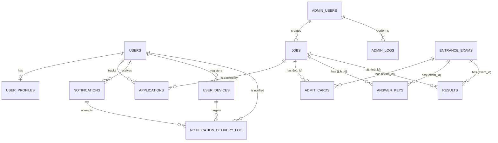

# Database Design

This document outlines the PostgreSQL database schema for the Hermes project, using SQLAlchemy models.

## Migration

Schema is managed through 4 Alembic migrations + 1 SQL migration:

| Migration | Description |
|-----------|-------------|
| `0001_initial_schema.py` | All core tables (users, profiles, jobs, applications, notifications, devices, admin, logs) |
| `0002_add_telegram_channel.py` | Adds `telegram` to `ck_delivery_channel` CHECK constraint |
| `0003_job_documents_tables.py` | Creates `admit_cards`, `answer_keys`, `results` linked to jobs |
| `0004_entrance_exams.py` | Creates `entrance_exams`; adds `exam_id` FK + CHECK constraint to doc tables |
| `007_rename_exam_db_objects.sql` | Renames indexes and constraints from `exam` to `entrance_exam` prefix |
| `008_remove_job_type_variants.sql` | Removes `admit_card`, `answer_key`, `result` from `jobs`; restricts to `latest_job` only |
| `009_rename_tables_clean.sql` | Rename tables: `job_vacancies`→`jobs`, `user_job_applications`→`applications`, `job_admit_cards`→`admit_cards`, `job_answer_keys`→`answer_keys`, `job_results`→`results` |
| `010_drop_job_type_column.sql` | Drop `job_type` column from `jobs` table (no longer needed) |

**Fresh install:**
```bash
docker exec -w /app -e PYTHONPATH=/app hermes_backend alembic upgrade head
# Creates all 14 tables in sequence (0001 → 0004)
```

**Existing database** (already at 0003):
```bash
docker exec -w /app -e PYTHONPATH=/app hermes_backend alembic upgrade 0004
```

---

## Entity Relationship Diagram (ERD)



> **Polymorphic constraint:** `admit_cards`, `answer_keys`, and `results` each have a DB-level
> CHECK constraint `(job_id IS NOT NULL AND exam_id IS NULL) OR (job_id IS NULL AND exam_id IS NOT NULL)`
> ensuring exactly one parent reference per row.

---

## Tables (14 total)

### 1. `users`
Core user account table. Integrated with Firebase Auth.

| Column | Type | Description |
|--------|------|-------------|
| `id` | UUID (PK) | Unique identifier |
| `email` | String(255) | User email (nullable, unique, indexed) |
| `password_hash` | String(255) | Legacy/Native password hash (nullable) |
| `full_name` | String(255) | Full name of the user |
| `phone` | String(20) | Contact number |
| `firebase_uid` | String(128) | Firebase Auth UID (unique, indexed) |
| `migration_status`| String(20) | `native`, `migrated`, or `legacy` |
| `status` | String(20) | `active`, `suspended`, `deleted` |
| `is_verified` | Boolean | Identity verification status |
| `is_email_verified`| Boolean | Email verification status |
| `is_phone_verified`| Boolean | Phone verification status (via OTP) |
| `last_login` | DateTime | Timestamp of last activity |
| `created_at` | DateTime | Account creation timestamp |

### 2. `user_profiles`
Detailed profile information and preferences.

| Column | Type | Description |
|--------|------|-------------|
| `id` | UUID (PK) | Unique identifier |
| `user_id` | UUID (FK) | Reference to `users.id` (unique) |
| `date_of_birth` | Date | Birth date |
| `gender` | String(20) | Gender |
| `category` | String(20) | Reservation category: `General`, `OBC`, `SC`, `ST`, `EWS`, `EBC`. Used for eligibility scoring in job recommendations. |
| `is_pwd` | Boolean | Person with Disability status |
| `is_ex_serviceman` | Boolean | Ex-serviceman status |
| `state` | String(100) | Current state |
| `city` | String(100) | Current city |
| `pincode` | String(10) | Postal code |
| `highest_qualification`| String(50) | Degree name |
| `education` | JSONB | Detailed education history |
| `notification_preferences` | JSONB | Channel toggles: `email`, `push`, `in_app`, `whatsapp` (each bool, default enabled) |
| `preferred_states` | JSONB (List)| States of interest for jobs |
| `preferred_categories` | JSONB (List)| Categories of interest |
| `followed_organizations` | JSONB (List)| Organizations the user follows |
| `fcm_tokens` | JSONB (List)| FCM device tokens — format: `[{"token": "...", "device_name": "...", "registered_at": "..."}]`. Read by NotificationService at push-send time. Invalid tokens auto-removed after send failure. |

### 3. `admin_users`
Internal staff accounts (Admin/Operator).

| Column | Type | Description |
|--------|------|-------------|
| `id` | UUID (PK) | Unique identifier |
| `email` | String(255) | Admin email (unique) |
| `password_hash` | String(255) | Bcrypt hash |
| `full_name` | String(255) | Full name |
| `role` | String(20) | `admin`, `operator` |
| `department` | String(255) | Internal department |
| `permissions` | JSONB | Granular permission flags |
| `status` | String(20) | `active`, `suspended` |

### 4. `jobs`
Government job postings and employment opportunities.

**Note:** This table now exclusively stores job vacancies (`job_type='latest_job'`). 
Document announcements (admit cards, answer keys, results) are managed through:
- Table 10: `admit_cards` - Per-phase admit card download links
- Table 11: `answer_keys` - Per-phase answer key files  
- Table 12: `results` - Per-phase result downloads

These document tables can link to either a job (via `job_id`) or an entrance exam (via `exam_id`).

| Column | Type | Description |
|--------|------|-------------|
| `id` | UUID (PK) | Unique identifier |
| `job_title` | String(500) | Full title of the recruitment |
| `slug` | String(500) | URL slug (unique) |
| `organization` | String(255) | Hiring authority (SSC, UPSC, etc.) |
| `department` | String(255) | Specific department |
| `job_type` | String(50) | Content type: `latest_job` (only value allowed) |
| `employment_type` | String(50) | `permanent`, `contract`, etc. (for latest_job only) |
| `qualification_level`| String(50) | `10th`, `graduate`, etc. |
| `total_vacancies` | Integer | Total seat count |
| `vacancy_breakdown` | JSONB | Seat distribution by category/state |
| `description` | Text | Full HTML description |
| `eligibility` | JSONB | Age limits, physical standards, medical |
| `application_details`| JSONB | Links, fees, instruction links |
| `documents` | JSONB | Required docs (format, size) |
| `salary` | JSONB | Pay scale, level, allowances |
| `notification_date` | Date | Date of official notice |
| `application_start` | Date | Start date for applying |
| `application_end` | Date | Deadline for applying |
| `exam_start` | Date | Date of first phase exam |
| `status` | String(20) | `draft`, `active`, `expired`, `cancelled` |
| `is_featured` | Boolean | Show in homepage carousel |
| `is_urgent` | Boolean | Close to deadline |
| `created_by` | UUID (FK) | Reference to `admin_users.id` |

### 5. `applications`
Tracks which user is interested in which job.

| Column | Type | Description |
|--------|------|-------------|
| `id` | UUID (PK) | Unique identifier |
| `user_id` | UUID (FK) | Reference to `users.id` |
| `job_id` | UUID (FK) | Reference to `jobs.id` |
| `application_number`| String(100) | User's actual reg number from gov site |
| `is_priority` | Boolean | User-marked priority |
| `status` | String(50) | `applied`, `shortlisted`, `rejected`, etc. |
| `notes` | Text | User's private notes |
| `applied_on` | DateTime | Tracking creation date |

### 6. `notifications`
Master records for all system notifications.

| Column | Type | Description |
|--------|------|-------------|
| `id` | UUID (PK) | Unique identifier |
| `user_id` | UUID (FK) | Target user |
| `type` | String(60) | `job_alert`, `application_update`, `system` |
| `title` | String(500) | Short title |
| `message` | Text | Body content |
| `action_url` | Text | Click-through link |
| `is_read` | Boolean | Read status (in_app) |
| `sent_via` | ARRAY(String) | Channels used (`push`, `email`, `sms`) |
| `priority` | String(10) | `low`, `medium`, `high` |

### 7. `user_devices`
Device registry — stores device metadata. **Push notifications read FCM tokens from `user_profiles.fcm_tokens`, not this table.** `user_devices` exists for future use (device-level fingerprint deduplication, device management UI) but is not populated by the current FCM token registration API.

| Column | Type | Description |
|--------|------|-------------|
| `id` | UUID (PK) | Unique identifier |
| `user_id` | UUID (FK) | Owner of the device |
| `fcm_token` | String(500) | FCM token (not used for push delivery — see `user_profiles.fcm_tokens`) |
| `device_name` | String(255) | "Chrome on Windows", "iPhone 13" |
| `device_type` | String(20) | `web`, `pwa`, `ios`, `android` |
| `device_fingerprint`| String(255) | Browser fingerprint (future use for deduplication) |
| `is_active` | Boolean | Token validity status |

### 8. `admin_logs`
Audit logs for staff actions.

| Column | Type | Description |
|--------|------|-------------|
| `id` | UUID (PK) | Unique identifier |
| `admin_id` | UUID (FK) | Admin who took the action |
| `action` | String(100) | `create_job`, `suspend_user`, etc. |
| `resource_type` | String(100) | `job_vacancies`, `users` |
| `resource_id` | UUID | Affected resource ID |
| `details` | Text | Human-readable summary |
| `changes` | JSONB | Before/After snapshot |
| `ip_address` | INET | Source IP |

### 9. `notification_delivery_log`
Channel-level delivery tracking.

| Column | Type | Description |
|--------|------|-------------|
| `id` | UUID (PK) | Unique identifier |
| `notification_id` | UUID (FK) | Parent notification |
| `channel` | String(20) | `ck_delivery_channel`: in_app, push, email, whatsapp, telegram |
| `status` | String(20) | `ck_delivery_status`: pending, sent, delivered, failed, skipped |
| `device_id` | UUID (FK) | Targeted device (for push) |
| `error_message` | Text | Failure reason (from OCI/FCM) |
| `delivered_at` | DateTime | Verified delivery time |

---

### 10. `admit_cards`
Per-phase admit card links. Linked to either a **job** or an **entrance exam** (polymorphic).

| Column | Type | Description |
|--------|------|-------------|
| `id` | UUID (PK) | Unique identifier |
| `job_id` | UUID (FK, nullable) | Reference to `jobs.id` |
| `exam_id` | UUID (FK, nullable) | Reference to `entrance_exams.id` |
| `phase_number` | SmallInteger | Exam phase (1, 2, …) |
| `title` | String(255) | E.g. "SSC CGL Tier-1 2025 Admit Card" |
| `download_url` | Text | Link to download the admit card |
| `valid_from` | Date | Validity start (exam start date) |
| `valid_until` | Date | Validity end (exam end date) |
| `notes` | Text | Important instructions for candidates |
| `published_at` | DateTime | When this admit card was released |

> CHECK: `(job_id IS NOT NULL AND exam_id IS NULL) OR (job_id IS NULL AND exam_id IS NOT NULL)`

---

### 11. `answer_keys`
Per-phase answer keys (provisional or final). Polymorphic.

| Column | Type | Description |
|--------|------|-------------|
| `id` | UUID (PK) | Unique identifier |
| `job_id` | UUID (FK, nullable) | Reference to `jobs.id` |
| `exam_id` | UUID (FK, nullable) | Reference to `entrance_exams.id` |
| `phase_number` | SmallInteger | Exam phase |
| `title` | String(255) | E.g. "JEE Main Session 1 Provisional Answer Key" |
| `answer_key_type` | String(20) | `ck_answer_key_type`: `provisional`, `final` |
| `files` | JSONB | Array of `{label, url}` — one entry per paper/set |
| `objection_url` | Text | URL to raise objections (provisional keys only) |
| `objection_deadline` | Date | Deadline for filing objections |
| `published_at` | DateTime | Release timestamp |

---

### 12. `results`
Per-phase results (shortlist, cutoff, merit list, final). Polymorphic.

| Column | Type | Description |
|--------|------|-------------|
| `id` | UUID (PK) | Unique identifier |
| `job_id` | UUID (FK, nullable) | Reference to `jobs.id` |
| `exam_id` | UUID (FK, nullable) | Reference to `entrance_exams.id` |
| `phase_number` | SmallInteger | Exam phase |
| `title` | String(255) | E.g. "NEET PG 2026 Result & Score Card" |
| `result_type` | String(20) | `ck_result_type`: `shortlist`, `cutoff`, `merit_list`, `final` |
| `download_url` | Text | Link to view/download the result |
| `cutoff_marks` | JSONB | Category-wise cutoff marks `{UR: 138, OBC: 108, ...}` |
| `total_qualified` | Integer | Number of candidates who qualified |
| `notes` | Text | Additional notes |
| `published_at` | DateTime | Release timestamp |

---

### 13. `entrance_exams`
Admission / entrance exams (NEET, JEE, CLAT, CAT, GATE, CUET etc.) — **separate from `job_vacancies`**.
These are educational admissions, not government job recruitments.

| Column | Type | Description |
|--------|------|-------------|
| `id` | UUID (PK) | Unique identifier |
| `slug` | String(500) | URL slug (unique) |
| `exam_name` | String(500) | E.g. "NTA NEET PG 2026 — Medical PG Entrance" |
| `conducting_body` | String(255) | E.g. "National Testing Agency" |
| `counselling_body` | String(255) | E.g. "MCC", "JoSAA", "CLAT Consortium" |
| `exam_type` | String(20) | `ck_entrance_exam_type`: `ug`, `pg`, `doctoral`, `lateral` |
| `stream` | String(30) | `ck_entrance_exam_stream`: `medical`, `engineering`, `law`, `management`, `arts_science`, `general` |
| `eligibility` | JSONB | `{min_qualification, attempts_limit, age_limit, registration, ...}` |
| `exam_details` | JSONB | `{exam_pattern: [{phase, subjects, total_marks, duration_minutes, negative_marking, exam_mode}]}` |
| `selection_process` | JSONB | `[{phase, name, qualifying}]` |
| `seats_info` | JSONB | `{total_seats, by_category, note}` — institution/seat counts |
| `application_start` | Date | Registration opens |
| `application_end` | Date | Registration deadline |
| `exam_date` | Date | Date of main exam |
| `result_date` | Date | Expected result date |
| `counselling_start` | Date | Counselling round start |
| `fee_general` | Integer | Application fee — General/UR (INR) |
| `fee_obc` | Integer | Application fee — OBC-NCL (INR) |
| `fee_sc_st` | Integer | Application fee — SC/ST (INR) |
| `fee_ews` | Integer | Application fee — EWS (INR) |
| `fee_female` | Integer | Application fee — Female/PwBD (INR) |
| `description` | Text | Full HTML description |
| `short_description` | Text | One-liner for listing cards |
| `source_url` | Text | Official website URL |
| `status` | String(20) | `ck_entrance_exam_status`: `upcoming`, `active`, `completed`, `cancelled` |
| `is_featured` | Boolean | Highlight in listings |
| `views` | Integer | View count (incremented on detail page load) |
| `published_at` | DateTime | When first published |
| `search_vector` | tsvector | GENERATED ALWAYS — GIN-indexed FTS on exam_name + conducting_body + description |

**Indexes:**
- `idx_entrance_exams_search` — GIN index on `search_vector` for full-text search
- `idx_entrance_exams_slug` — UNIQUE index on `slug`
- `idx_entrance_exams_stream_status` — Composite index on `(stream, status, created_at)` for filtered listings

**Key design difference from `job_vacancies`:**

| Dimension | `job_vacancies` | `entrance_exams` |
|-----------|-----------------|------------------|
| Outcome | Employment (govt job) | Education (college/IIT/NLU seat) |
| Vacancies | `total_vacancies` + `vacancy_breakdown` | `seats_info` (seats by institution) |
| Salary | `salary_initial`, `salary_max` | — (not applicable) |
| Counselling | — | `counselling_body` |
| Attempts | — | `eligibility.attempts_limit` |

---

### 14. `alembic_version`
Alembic migration state tracker. Single row with the current revision ID.
