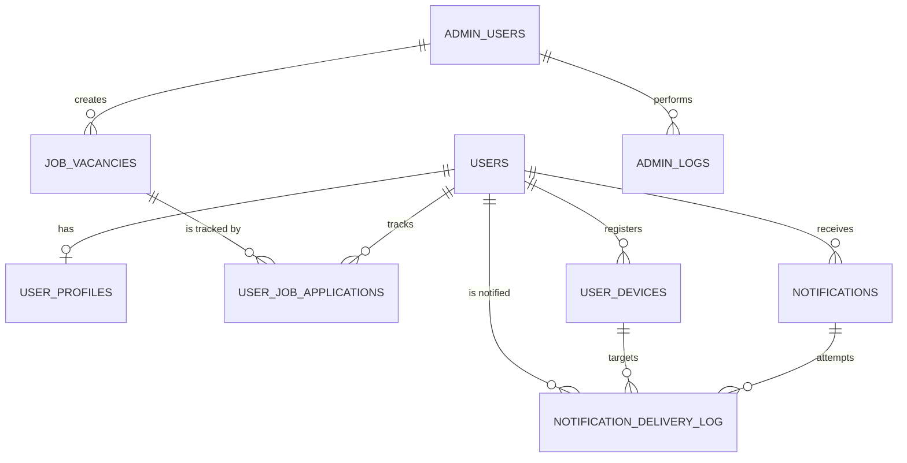

# Database Design

This document outlines the PostgreSQL database schema for the Hermes project, using SQLAlchemy models.

## Entity Relationship Diagram (ERD)

---

## Tables

### 1. `users`
Core user account table. Integrated with Firebase Auth.

| Column | Type | Description |
|--------|------|-------------|
| `id` | UUID (PK) | Unique identifier |
| `email` | String(255) | User email (nullable, unique, indexed) |
| `password_hash` | String(255) | Legacy/Native password hash (nullable) |
| `full_name` | String(255) | Full name of the user |
| `phone` | String(20) | Contact number |
| `firebase_uid` | String(128) | Firebase Auth UID (unique, indexed) |
| `google_id` | String(255) | Social login ID (unique, indexed) |
| `migration_status`| String(20) | `native` or `migrated` |
| `status` | String(20) | `active`, `suspended`, `deleted` |
| `is_verified` | Boolean | Identity verification status |
| `is_email_verified`| Boolean | Email verification status |
| `last_login` | DateTime | Timestamp of last activity |
| `created_at` | DateTime | Account creation timestamp |

### 2. `user_profiles`
Detailed profile information and preferences.

| Column | Type | Description |
|--------|------|-------------|
| `id` | UUID (PK) | Unique identifier |
| `user_id` | UUID (FK) | Reference to `users.id` (unique) |
| `date_of_birth` | Date | Birth date |
| `gender` | String(20) | Gender |
| `category` | String(20) | Reservation category (UR, OBC, SC, ST, etc.) |
| `is_pwd` | Boolean | Person with Disability status |
| `is_ex_serviceman` | Boolean | Ex-serviceman status |
| `state` | String(100) | Current state |
| `city` | String(100) | Current city |
| `pincode` | String(10) | Postal code |
| `highest_qualification`| String(50) | Degree name |
| `education` | JSONB | Detailed education history |
| `notification_preferences` | JSONB | Channel toggles (email, push, in_app) |
| `preferred_states` | JSONB (List)| States of interest for jobs |
| `preferred_categories` | JSONB (List)| Categories of interest |
| `followed_organizations` | JSONB (List)| Organizations the user follows |
| `fcm_tokens` | JSONB (List)| (Legacy) push tokens list |

### 3. `admin_users`
Internal staff accounts (Admin/Operator).

| Column | Type | Description |
|--------|------|-------------|
| `id` | UUID (PK) | Unique identifier |
| `email` | String(255) | Admin email (unique) |
| `password_hash` | String(255) | Bcrypt hash |
| `full_name` | String(255) | Full name |
| `role` | String(20) | `admin`, `operator` |
| `department` | String(255) | Internal department |
| `permissions` | JSONB | Granular permission flags |
| `status` | String(20) | `active`, `suspended` |

### 4. `job_vacancies`
The primary entity for government jobs.

| Column | Type | Description |
|--------|------|-------------|
| `id` | UUID (PK) | Unique identifier |
| `job_title` | String(500) | Full title of the recruitment |
| `slug` | String(500) | URL slug (unique) |
| `organization` | String(255) | Hiring authority (SSC, UPSC, etc.) |
| `department` | String(255) | Specific department |
| `job_type` | String(50) | `latest_job`, `result`, `admit_card`, etc. |
| `employment_type` | String(50) | `permanent`, `contract`, etc. |
| `qualification_level`| String(50) | `10th`, `graduate`, etc. |
| `total_vacancies` | Integer | Total seat count |
| `vacancy_breakdown` | JSONB | Seat distribution by category/state |
| `description` | Text | Full HTML description |
| `eligibility` | JSONB | Age limits, physical standards, medical |
| `application_details`| JSONB | Links, fees, instruction links |
| `documents` | JSONB | Required docs (format, size) |
| `salary` | JSONB | Pay scale, level, allowances |
| `notification_date` | Date | Date of official notice |
| `application_start` | Date | Start date for applying |
| `application_end` | Date | Deadline for applying |
| `exam_start` | Date | Date of first phase exam |
| `status` | String(20) | `draft`, `active`, `expired`, `cancelled` |
| `is_featured` | Boolean | Show in homepage carousel |
| `is_urgent` | Boolean | Close to deadline |
| `created_by` | UUID (FK) | Reference to `admin_users.id` |

### 5. `user_job_applications`
Tracks which user is interested in which job.

| Column | Type | Description |
|--------|------|-------------|
| `id` | UUID (PK) | Unique identifier |
| `user_id` | UUID (FK) | Reference to `users.id` |
| `job_id` | UUID (FK) | Reference to `job_vacancies.id` |
| `application_number`| String(100) | User's actual reg number from gov site |
| `is_priority` | Boolean | User-marked priority |
| `status` | String(50) | `applied`, `shortlisted`, `rejected`, etc. |
| `notes` | Text | User's private notes |
| `applied_on` | DateTime | Tracking creation date |

### 6. `notifications`
Master records for all system notifications.

| Column | Type | Description |
|--------|------|-------------|
| `id` | UUID (PK) | Unique identifier |
| `user_id` | UUID (FK) | Target user |
| `type` | String(60) | `job_alert`, `application_update`, `system` |
| `title` | String(500) | Short title |
| `message` | Text | Body content |
| `action_url` | Text | Click-through link |
| `is_read` | Boolean | Read status (in_app) |
| `sent_via` | ARRAY(String) | Channels used (`push`, `email`, `sms`) |
| `priority` | String(10) | `low`, `medium`, `high` |

### 7. `user_devices`
Registry for push notification targets.

| Column | Type | Description |
|--------|------|-------------|
| `id` | UUID (PK) | Unique identifier |
| `user_id` | UUID (FK) | Owner of the device |
| `fcm_token` | String(500) | Firebase Cloud Messaging token |
| `device_name` | String(255) | "Chrome on Windows", "iPhone 13" |
| `device_type` | String(20) | `web`, `pwa`, `ios`, `android` |
| `device_fingerprint`| String(255) | Browser fingerprint for de-duplication |
| `is_active` | Boolean | Token validity status |

### 8. `admin_logs`
Audit logs for staff actions.

| Column | Type | Description |
|--------|------|-------------|
| `id` | UUID (PK) | Unique identifier |
| `admin_id` | UUID (FK) | Admin who took the action |
| `action` | String(100) | `create_job`, `suspend_user`, etc. |
| `resource_type` | String(100) | `job_vacancies`, `users` |
| `resource_id` | UUID | Affected resource ID |
| `details` | Text | Human-readable summary |
| `changes` | JSONB | Before/After snapshot |
| `ip_address` | INET | Source IP |

### 9. `notification_delivery_log`
Channel-level delivery tracking.

| Column | Type | Description |
|--------|------|-------------|
| `id` | UUID (PK) | Unique identifier |
| `notification_id` | UUID (FK) | Parent notification |
| `channel` | String(20) | `email`, `push`, `in_app` |
| `status` | String(20) | `pending`, `sent`, `failed`, `delivered` |
| `device_id` | UUID (FK) | Targeted device (for push) |
| `error_message` | Text | Failure reason (from OCI/FCM) |
| `delivered_at` | DateTime | Verified delivery time |
