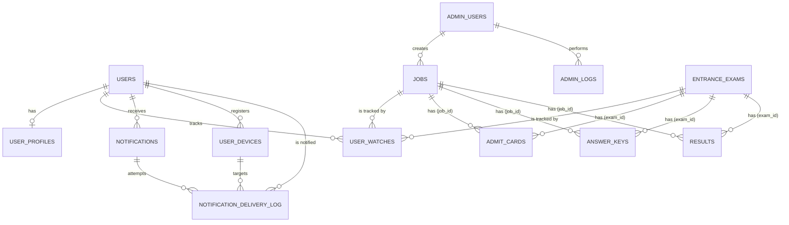

# Database Design

This document outlines the PostgreSQL database schema for the Hermes project, using SQLAlchemy models.

## Migrations

Schema is managed with Alembic:

| File | Description |
|------|-------------|
| `migrations/versions/0001_initial.py` | Complete initial schema — all 13 user tables |
| `migrations/versions/0002_add_followed_organizations.py` | Adds `followed_organizations JSONB NOT NULL DEFAULT '[]'` to `user_profiles` |

**Apply migrations:**
```bash
docker exec hermes_backend alembic -c /app/alembic.ini upgrade head
```

---

## Entity Relationship Diagram (ERD)



> **Polymorphic constraint:** `admit_cards`, `answer_keys`, and `results` each have a DB-level
> CHECK constraint `(job_id IS NOT NULL AND exam_id IS NULL) OR (job_id IS NULL AND exam_id IS NOT NULL)`
> ensuring exactly one parent reference per row.

---

## Tables (13 total)

### 1. `users`
Core user account table. Integrated with Firebase Auth.

| Column | Type | Nullable | Description |
|--------|------|----------|-------------|
| `id` | UUID (PK) | No | Auto-generated via `gen_random_uuid()` |
| `email` | String(255) | Yes | User email (unique, indexed) |
| `password_hash` | String(255) | Yes | Legacy/native password hash |
| `full_name` | String(255) | No | Full name |
| `phone` | String(20) | Yes | Contact number |
| `firebase_uid` | String(128) | Yes | Firebase Auth UID (unique, indexed) |
| `migration_status` | String(20) | No | `native` \| `migrated` \| `legacy`; default `native` |
| `status` | String(20) | No | `ck_users_status`: `active` \| `suspended` \| `deleted`; default `active` |
| `is_verified` | Boolean | No | Identity verification status; default `false` |
| `is_email_verified` | Boolean | No | Email OTP verified; default `false` |
| `is_phone_verified` | Boolean | No | Phone OTP verified; default `false` |
| `last_login` | DateTime | Yes | Timestamp of last login |
| `created_at` | DateTime | No | Account creation timestamp |
| `updated_at` | DateTime | No | Last update timestamp |

**Indexes:** `idx_users_email`, `idx_users_status`, `ix_users_firebase_uid` (unique)

---

### 2. `user_profiles`
Detailed profile information and preferences. One row per user (UNIQUE on `user_id`).

| Column | Type | Nullable | Description |
|--------|------|----------|-------------|
| `id` | UUID (PK) | No | Auto-generated |
| `user_id` | UUID (FK → `users.id`) | No | CASCADE delete; UNIQUE |
| `date_of_birth` | Date | Yes | Birth date |
| `gender` | String(20) | Yes | `ck_profiles_gender`: `Male` \| `Female` \| `Other` |
| `category` | String(20) | Yes | `ck_profiles_category`: `General` \| `OBC` \| `SC` \| `ST` \| `EWS` \| `EBC` |
| `is_pwd` | Boolean | No | Person with Disability; default `false` |
| `is_ex_serviceman` | Boolean | No | Ex-serviceman; default `false` |
| `state` | String(100) | Yes | Current state |
| `city` | String(100) | Yes | Current city |
| `pincode` | String(10) | Yes | Postal code |
| `highest_qualification` | String(50) | Yes | Degree name |
| `education` | JSONB | No | Detailed education history; default `{}` |
| `notification_preferences` | JSONB | No | Channel toggles (`email`, `push`, `in_app`, `whatsapp`); default `{}` |
| `preferred_states` | JSONB | No | States of interest for jobs; default `[]` |
| `preferred_categories` | JSONB | No | Categories of interest; default `[]` |
| `fcm_tokens` | JSONB | No | FCM tokens: `[{"token":"…","device_name":"…","registered_at":"…"}]`; default `[]` |
| `followed_organizations` | JSONB | No | Org names user follows; default `[]` *(added in migration 0002)* |
| `updated_at` | DateTime | No | Last update timestamp |

**Indexes:** GIN on `education`, GIN on `notification_preferences`

---

### 3. `admin_users`
Internal staff accounts (Admin/Operator).

| Column | Type | Nullable | Description |
|--------|------|----------|-------------|
| `id` | UUID (PK) | No | Auto-generated |
| `email` | String(255) | No | Admin email (unique) |
| `password_hash` | String(255) | No | Bcrypt hash |
| `full_name` | String(255) | No | Full name |
| `phone` | String(20) | Yes | Contact number |
| `role` | String(20) | No | `ck_admin_users_role`: `admin` \| `operator`; default `operator` |
| `department` | String(255) | Yes | Internal department |
| `permissions` | JSONB | No | Granular permission flags; default `{}` |
| `status` | String(20) | No | `ck_admin_users_status`: `active` \| `suspended` \| `deleted`; default `active` |
| `is_email_verified` | Boolean | No | Email verified status; default `false` |
| `last_login` | DateTime | Yes | Timestamp of last login |
| `created_at` | DateTime | No | Creation timestamp |
| `updated_at` | DateTime | No | Last update timestamp |

**Indexes:** `idx_admin_users_email`, `idx_admin_users_status`

---

### 4. `jobs`
Government job vacancies. Document releases (admit cards, answer keys, results) are stored in their own tables and link back via `job_id`.

| Column | Type | Nullable | Description |
|--------|------|----------|-------------|
| `id` | UUID (PK) | No | Auto-generated |
| `job_title` | String(500) | No | Full title of the recruitment |
| `slug` | String(500) | No | URL slug (unique) |
| `organization` | String(255) | No | Hiring authority (SSC, UPSC, etc.), indexed |
| `department` | String(255) | Yes | Specific department |
| `employment_type` | String(50) | Yes | `ck_jobs_employment_type`: `permanent` \| `temporary` \| `contract` \| `apprentice`; default `permanent` |
| `qualification_level` | String(50) | Yes | `10th`, `graduate`, etc., indexed |
| `total_vacancies` | Integer | Yes | Total seat count |
| `vacancy_breakdown` | JSONB | No | Seat distribution by category/state; default `{}` |
| `description` | Text | Yes | Full HTML description |
| `short_description` | Text | Yes | One-liner for listing cards |
| `eligibility` | JSONB | No | Age limits, physical standards, medical; default `{}` |
| `application_details` | JSONB | No | Links, fees, instruction links; default `{}` |
| `documents` | JSONB | No | Required docs (format, size); default `[]` |
| `source_url` | Text | Yes | Official notification URL |
| `notification_date` | Date | Yes | Date of official notice |
| `application_start` | Date | Yes | Start date for applying |
| `application_end` | Date | Yes | Deadline for applying, indexed |
| `exam_start` | Date | Yes | Date of first phase exam |
| `exam_end` | Date | Yes | Date of last phase exam |
| `result_date` | Date | Yes | Expected result date |
| `exam_details` | JSONB | No | Exam pattern, phases; default `{}` |
| `salary_initial` | Integer | Yes | Minimum pay (INR) |
| `salary_max` | Integer | Yes | Maximum pay (INR) |
| `salary` | JSONB | No | Pay scale, level, allowances; default `{}` |
| `selection_process` | JSONB | No | List of selection stages; default `[]` |
| `fee_general` | Integer | Yes | Application fee — General/UR (INR) |
| `fee_obc` | Integer | Yes | Application fee — OBC-NCL (INR) |
| `fee_sc_st` | Integer | Yes | Application fee — SC/ST (INR) |
| `fee_ews` | Integer | Yes | Application fee — EWS (INR) |
| `fee_female` | Integer | Yes | Application fee — Female/PwBD (INR) |
| `status` | String(20) | No | `ck_jobs_status`: `draft` \| `active` \| `expired` \| `cancelled` \| `upcoming`; default `draft` |
| `created_by` | UUID (FK → `admin_users.id`) | Yes | Admin who created the job |
| `source` | String(20) | No | `ck_jobs_source`: `manual` \| `pdf_upload`; default `manual` |
| `source_pdf_path` | Text | Yes | Path to uploaded PDF (if source = `pdf_upload`) |
| `published_at` | DateTime | Yes | When job was approved and published |
| `created_at` | DateTime | No | Creation timestamp |
| `updated_at` | DateTime | No | Last update timestamp |
| `search_vector` | tsvector | — | GENERATED ALWAYS (job_title A, organization B, description C) — GIN indexed |

**Indexes:** `idx_jobs_organization`, `idx_jobs_status_created`, `idx_jobs_qual_level`, `idx_jobs_application_end`, `idx_jobs_org_status`, GIN on `eligibility`, GIN on `search_vector`

---

### 5. `notifications`
Master records for all system notifications.

| Column | Type | Nullable | Description |
|--------|------|----------|-------------|
| `id` | UUID (PK) | No | Auto-generated |
| `user_id` | UUID (FK → `users.id`) | No | Target user; CASCADE delete |
| `entity_type` | String(50) | Yes | Type of entity that triggered this (`job`, `exam`, etc.) |
| `entity_id` | UUID | Yes | ID of the triggering entity |
| `type` | String(60) | No | Notification type (`job_alert`, `system`, etc.) |
| `title` | String(500) | No | Short title |
| `message` | Text | No | Body content |
| `action_url` | Text | Yes | Click-through link |
| `is_read` | Boolean | No | In-app read status; default `false` |
| `sent_via` | ARRAY(String) | Yes | Channels actually used (e.g. `['push', 'email']`) |
| `priority` | String(10) | No | `ck_notifications_priority`: `low` \| `medium` \| `high`; default `medium` |
| `created_at` | DateTime | No | Creation timestamp |
| `read_at` | DateTime | Yes | When notification was read |
| `expires_at` | DateTime | No | Auto-delete after 90 days; default `NOW() + 90 days` |

**Indexes:** `idx_notifications_user_read`, `idx_notifications_user_created`, `idx_notifications_expires`

---

### 6. `admin_logs`
Audit logs for staff actions. Auto-expire after 30 days.

| Column | Type | Nullable | Description |
|--------|------|----------|-------------|
| `id` | UUID (PK) | No | Auto-generated |
| `admin_id` | UUID (FK → `admin_users.id`) | No | Admin who performed the action |
| `action` | String(100) | No | `create_job`, `suspend_user`, `admin_login`, etc. |
| `resource_type` | String(100) | Yes | `job`, `user`, `entrance_exam`, etc. |
| `resource_id` | UUID | Yes | Affected resource ID |
| `details` | Text | Yes | Human-readable summary |
| `changes` | JSONB | No | Before/after snapshot; default `{}` |
| `ip_address` | INET | Yes | Source IP address |
| `user_agent` | Text | Yes | Browser/client user-agent |
| `timestamp` | DateTime | No | When the action occurred; default `NOW()` |
| `expires_at` | DateTime | No | Auto-delete after 30 days; default `NOW() + 30 days` |

**Indexes:** `idx_admin_logs_admin_ts`, `idx_admin_logs_expires`

---

### 7. `user_devices`
Device registry — stores device metadata. **Push notifications read FCM tokens from `user_profiles.fcm_tokens`, not this table.** `user_devices` exists for future use (device-level fingerprint deduplication, device management UI) but is not populated by the current FCM token registration API.

| Column | Type | Nullable | Description |
|--------|------|----------|-------------|
| `id` | UUID (PK) | No | Auto-generated |
| `user_id` | UUID (FK → `users.id`) | No | Device owner; CASCADE delete |
| `fcm_token` | String(500) | Yes | FCM token (nullable; unique partial index where not null) |
| `device_name` | String(255) | No | "Chrome on Windows", "iPhone 13"; default `Unknown` |
| `device_type` | String(20) | No | `ck_devices_device_type`: `web` \| `pwa` \| `android` \| `ios`; default `web` |
| `device_fingerprint` | String(255) | Yes | Browser fingerprint |
| `is_active` | Boolean | No | Token validity; default `true` |
| `last_active_at` | DateTime | No | Last seen timestamp; default `NOW()` |
| `created_at` | DateTime | No | Registration timestamp |

**Indexes:** `idx_devices_user_id`, `idx_devices_fcm_token` (unique partial), `idx_devices_fingerprint`

---

### 8. `notification_delivery_log`
Channel-level delivery tracking per notification attempt.

| Column | Type | Nullable | Description |
|--------|------|----------|-------------|
| `id` | UUID (PK) | No | Auto-generated |
| `notification_id` | UUID (FK → `notifications.id`) | No | Parent notification; CASCADE delete |
| `user_id` | UUID (FK → `users.id`) | No | Target user; CASCADE delete |
| `channel` | String(20) | No | `ck_delivery_channel`: `in_app` \| `push` \| `email` \| `whatsapp` \| `telegram` |
| `status` | String(20) | No | `ck_delivery_status`: `pending` \| `sent` \| `delivered` \| `failed`; default `pending` |
| `device_id` | UUID (FK → `user_devices.id`) | Yes | Targeted device (push only); SET NULL on delete |
| `error_message` | Text | Yes | Failure reason (from OCI/FCM) |
| `attempted_at` | DateTime | Yes | When delivery was attempted |
| `delivered_at` | DateTime | Yes | Verified delivery time |
| `created_at` | DateTime | No | Record creation timestamp |

**Indexes:** `idx_delivery_log_notif`, `idx_delivery_log_user`

---

### 9. `admit_cards`
Per-phase admit card links. Linked to either a **job** or an **entrance exam** (polymorphic).

| Column | Type | Nullable | Description |
|--------|------|----------|-------------|
| `id` | UUID (PK) | No | Auto-generated |
| `job_id` | UUID (FK → `jobs.id`, nullable) | Yes | CASCADE delete |
| `exam_id` | UUID (FK → `entrance_exams.id`, nullable) | Yes | CASCADE delete |
| `phase_number` | SmallInteger | Yes | Exam phase (1, 2, …) |
| `title` | String(255) | No | E.g. "SSC CGL Tier-1 2025 Admit Card" |
| `download_url` | Text | No | Link to download the admit card |
| `valid_from` | Date | Yes | Validity start (exam start date) |
| `valid_until` | Date | Yes | Validity end (exam end date) |
| `notes` | Text | Yes | Important instructions for candidates |
| `published_at` | DateTime | Yes | When this admit card was released |
| `created_at` | DateTime | No | Creation timestamp |
| `updated_at` | DateTime | No | Last update timestamp |

> `ck_admit_cards_source`: `(job_id IS NOT NULL AND exam_id IS NULL) OR (job_id IS NULL AND exam_id IS NOT NULL)`

**Indexes:** `idx_admit_cards_job`, `idx_admit_cards_exam`, `idx_admit_cards_pub`

---

### 10. `answer_keys`
Per-phase answer keys (provisional or final). Polymorphic.

| Column | Type | Nullable | Description |
|--------|------|----------|-------------|
| `id` | UUID (PK) | No | Auto-generated |
| `job_id` | UUID (FK → `jobs.id`, nullable) | Yes | CASCADE delete |
| `exam_id` | UUID (FK → `entrance_exams.id`, nullable) | Yes | CASCADE delete |
| `phase_number` | SmallInteger | Yes | Exam phase |
| `title` | String(255) | No | E.g. "JEE Main Session 1 Provisional Answer Key" |
| `answer_key_type` | String(20) | No | `ck_answer_key_type`: `provisional` \| `final`; default `provisional` |
| `files` | JSONB | No | Array of `{label, url}` — one entry per paper/set; default `[]` |
| `objection_url` | Text | Yes | URL to raise objections (provisional keys only) |
| `objection_deadline` | Date | Yes | Deadline for filing objections |
| `published_at` | DateTime | Yes | Release timestamp |
| `created_at` | DateTime | No | Creation timestamp |
| `updated_at` | DateTime | No | Last update timestamp |

> `ck_answer_keys_source`: `(job_id IS NOT NULL AND exam_id IS NULL) OR (job_id IS NULL AND exam_id IS NOT NULL)`

**Indexes:** `idx_answer_keys_job`, `idx_answer_keys_exam`, `idx_answer_keys_type`

---

### 11. `results`
Per-phase results (shortlist, cutoff, merit list, final). Polymorphic.

| Column | Type | Nullable | Description |
|--------|------|----------|-------------|
| `id` | UUID (PK) | No | Auto-generated |
| `job_id` | UUID (FK → `jobs.id`, nullable) | Yes | CASCADE delete |
| `exam_id` | UUID (FK → `entrance_exams.id`, nullable) | Yes | CASCADE delete |
| `phase_number` | SmallInteger | Yes | Exam phase |
| `title` | String(255) | No | E.g. "NEET PG 2026 Result & Score Card" |
| `result_type` | String(20) | No | `ck_result_type`: `shortlist` \| `cutoff` \| `merit_list` \| `final` |
| `download_url` | Text | Yes | Link to view/download the result |
| `cutoff_marks` | JSONB | Yes | Category-wise cutoff marks `{"UR": 138, "OBC": 108, ...}` |
| `total_qualified` | Integer | Yes | Number of candidates who qualified |
| `notes` | Text | Yes | Additional notes |
| `published_at` | DateTime | Yes | Release timestamp |
| `created_at` | DateTime | No | Creation timestamp |
| `updated_at` | DateTime | No | Last update timestamp |

> `ck_results_source`: `(job_id IS NOT NULL AND exam_id IS NULL) OR (job_id IS NULL AND exam_id IS NOT NULL)`

**Indexes:** `idx_results_job`, `idx_results_exam`, `idx_results_pub`

---

### 12. `entrance_exams`
Entrance exams (NEET, JEE, CLAT, CAT, GATE, CUET etc.) — separate from `jobs`.
These are educational entrance examinations, not government job recruitments.

| Column | Type | Nullable | Description |
|--------|------|----------|-------------|
| `id` | UUID (PK) | No | Auto-generated |
| `slug` | String(500) | No | URL slug (unique) |
| `exam_name` | String(500) | No | E.g. "NTA NEET PG 2026 — Medical PG Entrance" |
| `conducting_body` | String(255) | No | E.g. "National Testing Agency" |
| `counselling_body` | String(255) | Yes | E.g. "MCC", "JoSAA", "CLAT Consortium" |
| `exam_type` | String(20) | No | `ck_entrance_exam_type`: `ug` \| `pg` \| `doctoral` \| `lateral`; default `pg` |
| `stream` | String(30) | No | `ck_entrance_exam_stream`: `medical` \| `engineering` \| `law` \| `management` \| `arts_science` \| `general`; default `general` |
| `eligibility` | JSONB | No | `{min_qualification, attempts_limit, age_limit, ...}`; default `{}` |
| `exam_details` | JSONB | No | `{exam_pattern: [{phase, subjects, total_marks, duration_minutes, negative_marking, exam_mode}]}`; default `{}` |
| `selection_process` | JSONB | No | `[{phase, name, qualifying}]`; default `[]` |
| `seats_info` | JSONB | Yes | `{total_seats, by_category, note}` — institution/seat counts |
| `application_start` | Date | Yes | Registration opens |
| `application_end` | Date | Yes | Registration deadline |
| `exam_date` | Date | Yes | Date of main exam |
| `result_date` | Date | Yes | Expected result date |
| `counselling_start` | Date | Yes | Counselling round start |
| `fee_general` | Integer | Yes | Application fee — General/UR (INR) |
| `fee_obc` | Integer | Yes | Application fee — OBC-NCL (INR) |
| `fee_sc_st` | Integer | Yes | Application fee — SC/ST (INR) |
| `fee_ews` | Integer | Yes | Application fee — EWS (INR) |
| `fee_female` | Integer | Yes | Application fee — Female/PwBD (INR) |
| `description` | Text | Yes | Full HTML description |
| `short_description` | Text | Yes | One-liner for listing cards |
| `source_url` | Text | Yes | Official website URL |
| `status` | String(20) | No | `ck_entrance_exam_status`: `upcoming` \| `active` \| `completed` \| `cancelled`; default `active` |
| `published_at` | DateTime | Yes | When first published |
| `created_at` | DateTime | No | Creation timestamp |
| `updated_at` | DateTime | No | Last update timestamp |
| `search_vector` | tsvector | — | GENERATED ALWAYS (exam_name A, conducting_body B, description C) — GIN indexed |

**Indexes:** `idx_entrance_exams_slug` (unique), `idx_entrance_exams_stream_status`, `idx_entrance_exams_search` (GIN)

**Key design difference from `jobs`:**

| Dimension | `jobs` | `entrance_exams` |
|-----------|--------|------------------|
| Outcome | Employment (govt job) | Education (college/IIT/NLU seat) |
| Vacancies | `total_vacancies` + `vacancy_breakdown` | `seats_info` (seats by institution) |
| Salary | `salary_initial`, `salary_max` | — (not applicable) |
| Counselling | — | `counselling_body`, `counselling_start` |
| Attempts | — | `eligibility.attempts_limit` |

---

### 13. `user_watches`
Tracks which jobs or exams a user is watching for notification delivery.

| Column | Type | Nullable | Description |
|--------|------|----------|-------------|
| `id` | UUID (PK) | No | Auto-generated |
| `user_id` | UUID (FK → `users.id`) | No | CASCADE delete |
| `entity_type` | String(10) | No | `ck_user_watches_entity_type`: `job` \| `exam` |
| `entity_id` | UUID | No | ID of the watched job or entrance exam |
| `created_at` | DateTime | No | When the watch was created |

> UNIQUE constraint `uq_user_watch` on `(user_id, entity_type, entity_id)`. Max 100 watches per user (enforced in application layer).

**Indexes:** `ix_user_watches_user_id`, `ix_user_watches_entity`

---

> **`alembic_version`** — Alembic-managed table, single row tracking the current migration revision. Not a user-defined table.
